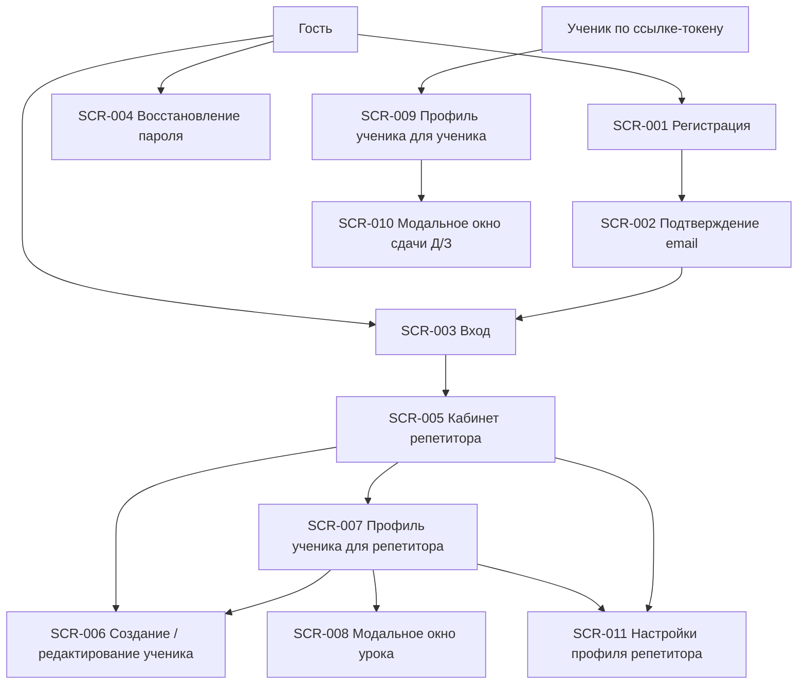

# TUTOR-SPACE: реестр экранов и постановки на дизайн

Источники:

- [TUTOR_SPACE_SPEC.md](/Users/olazavalisina/Documents/сайт/TUTOR_SPACE_SPEC.md)
- [TUTOR_SPACE_REQUIREMENTS.md](/Users/olazavalisina/Documents/сайт/TUTOR_SPACE_REQUIREMENTS.md)

## 1. Принцип документа

Этот документ описывает дизайн-задачи для MVP TUTOR-SPACE. Он не заменяет техническое ТЗ и не описывает интерфейс пиксель-в-пиксель. Цель документа - дать продуктовому дизайнеру ясное понимание экранов, сценариев, состояний, рисков и связей с требованиями.

## 2. Единый шаблон описания экрана

Каждый экран описывается по единому шаблону:

| Поле | Что описывать |
|---|---|
| ID экрана | Уникальный идентификатор экрана в формате `SCR-*`. |
| Название | Человеческое название экрана. |
| Роль пользователя | Репетитор, ученик или гость. |
| Статус | MVP или Post-MVP. |
| Основание | Прямой источник из ТЗ или пометка "выведено из требований". |
| Цель экрана | Какую пользовательскую задачу решает экран. |
| Основной сценарий | Короткое описание пользовательского пути. |
| Ключевые действия | Что пользователь должен суметь сделать на экране. |
| Данные и контент | Какие данные, тексты, поля и элементы должны быть представлены. |
| Состояния | Пустое, загрузка, ошибка, заполненное, успех. |
| Ограничения доступа | Кто может открыть экран и что нельзя делать. |
| Адаптивное поведение | Как экран должен вести себя на desktop и mobile. |
| UX-акценты и риски | Что особенно важно для удобства, ясности и снижения ошибок. |
| Связанные требования | ID требований из `TUTOR_SPACE_REQUIREMENTS.md`. |
| Источник | Разделы `TUTOR_SPACE_SPEC.md`. |

## 3. Реестр экранов MVP

| ID | Экран | Роль | Статус | Основание | Краткое назначение | Связанные требования | Источник |
|---|---|---|---|---|---|---|---|
| SCR-001 | Регистрация репетитора | Гость | MVP | Прямо описан в ТЗ | Создать аккаунт репетитора | FR-001, FR-002, FR-069, US-001, UC-001 | SPEC 2.1, 14.1, 15.1 |
| SCR-002 | Подтверждение email | Гость / репетитор | MVP | Выведено из требований: подтверждение email включено | Объяснить пользователю, что нужно подтвердить почту | FR-002, US-001, UC-001 | SPEC 2.1, 14.1, 15.1 |
| SCR-003 | Вход | Гость | MVP | Прямо описан в ТЗ | Авторизовать репетитора | FR-003, FR-070, UC-002 | SPEC 2.1, 14.2 |
| SCR-004 | Восстановление пароля | Гость | MVP | Прямо описан в ТЗ | Запросить ссылку восстановления пароля | FR-004, FR-071, UC-003 | SPEC 2.1, 14.3 |
| SCR-005 | Кабинет репетитора | Репетитор | MVP | Прямо описан в ТЗ | Управлять учениками и видеть Д/З на проверке | FR-017-FR-021, FR-068, US-010, US-011, UC-005 | SPEC 5, 14.4 |
| SCR-006 | Создание / редактирование ученика | Репетитор | MVP | Прямо описан в ТЗ | Создать или изменить карточку ученика | FR-006-FR-010, US-002, US-009, UC-004, UC-008 | SPEC 4, 14.5 |
| SCR-007 | Профиль ученика для репетитора | Репетитор | MVP | Прямо описан в ТЗ | Вести уроки, виджеты, Д/З, оплату и ссылку ученика | FR-022-FR-058, FR-066-FR-068, UC-007, UC-009-UC-013, UC-019, UC-020 | SPEC 6-10, 12, 14.6 |
| SCR-008 | Модальное окно урока | Репетитор | MVP | Прямо описан в ТЗ | Создать или отредактировать урок | FR-033-FR-058, US-004, UC-010-UC-013 | SPEC 9, 10, 14.8 |
| SCR-009 | Профиль ученика для ученика | Ученик | MVP | Прямо описан в ТЗ | Смотреть профиль, актуальное Д/З, уроки, материалы и комментарии | FR-014-FR-016, FR-022-FR-030, FR-031-FR-038, FR-040-FR-052, FR-066-FR-067, US-005, US-013, US-014, US-016 | SPEC 2.2, 6-9, 12, 14.7 |
| SCR-010 | Модальное окно сдачи Д/З | Ученик | MVP | Прямо описан в ТЗ | Загрузить фото Д/З и комментарий | FR-050, FR-051, FR-059-FR-065, US-006, US-008, UC-017, UC-018 | SPEC 9.10, 11, 14.9 |
| SCR-011 | Настройки профиля репетитора | Репетитор | MVP | Прямо описан в ТЗ, состав частично открыт | Управлять базовыми данными профиля | FR-005, OQ-008 | SPEC 14.10, 22 |

## 4. Постановки на дизайн по экранам

### SCR-001. Регистрация репетитора

| Поле | Описание |
|---|---|
| Роль пользователя | Гость. |
| Статус | MVP. |
| Основание | Прямо описан в ТЗ. |
| Цель экрана | Дать новому репетитору быстрый и понятный способ создать аккаунт. |
| Основной сценарий | Пользователь открывает регистрацию, вводит имя, email, телефон и пароль, отправляет форму и переходит к подтверждению email. |
| Ключевые действия | Заполнить поля; отправить форму; перейти ко входу, если аккаунт уже есть. |
| Данные и контент | Поля: имя, email, телефон, пароль. Тексты должны объяснять, что после регистрации нужно подтвердить email. |
| Состояния | Пустое: форма без данных. Загрузка: отправка формы. Ошибка: некорректные или незаполненные поля. Заполненное: валидная форма. Успех: аккаунт создан, показан следующий шаг с email. |
| Ограничения доступа | Экран доступен гостю. Авторизованного репетитора логично перенаправлять в кабинет. |
| Адаптивное поведение | Desktop: компактная форма без перегруза. Mobile: одно поле под другим, крупные зоны ввода, удобная клавиатура для телефона/email. |
| UX-акценты и риски | Не создавать ощущение длинной анкеты. Телефон собирается на старте, но восстановление пароля в MVP через email, поэтому не обещать SMS-восстановление. |
| Связанные требования | FR-001, FR-002, FR-069, US-001, UC-001. |
| Источник | SPEC 2.1, 14.1, 15.1. |

### SCR-002. Подтверждение email

| Поле | Описание |
|---|---|
| Роль пользователя | Гость / репетитор в процессе регистрации. |
| Статус | MVP. |
| Основание | Выведено из требований: подтверждение email включено, после регистрации пользователь получает письмо. |
| Цель экрана | Спокойно объяснить пользователю, что аккаунт создан, но нужно подтвердить почту. |
| Основной сценарий | После регистрации пользователь видит сообщение о письме, проверяет почту и подтверждает email. |
| Ключевые действия | Понять следующий шаг; вернуться ко входу; при необходимости повторить попытку после проверки почты, если такая возможность будет реализована. |
| Данные и контент | Email пользователя; понятный текст "проверьте почту"; переход ко входу. |
| Состояния | Пустое не применяется. Загрузка: проверка/переход. Ошибка: email не подтвержден или ссылка недействительна. Заполненное: инструкция показана. Успех: email подтвержден, пользователь может войти. |
| Ограничения доступа | Экран относится к процессу регистрации. Не должен раскрывать данные других пользователей. |
| Адаптивное поведение | Desktop и mobile: короткий центрированный информационный экран, без лишних элементов. |
| UX-акценты и риски | Главный риск - пользователь не понимает, почему не может войти. Нужны спокойная формулировка и понятное действие. |
| Связанные требования | FR-002, US-001, UC-001. |
| Источник | SPEC 2.1, 14.1, 15.1. |

### SCR-003. Вход

| Поле | Описание |
|---|---|
| Роль пользователя | Гость. |
| Статус | MVP. |
| Основание | Прямо описан в ТЗ. |
| Цель экрана | Позволить репетитору войти в кабинет по email и паролю. |
| Основной сценарий | Пользователь вводит email и пароль, нажимает вход и попадает в кабинет. |
| Ключевые действия | Войти; перейти к восстановлению пароля; перейти к регистрации. |
| Данные и контент | Поля email и пароль, кнопка входа, ссылки на восстановление и регистрацию. |
| Состояния | Пустое: поля не заполнены. Загрузка: проверка данных. Ошибка: неверные данные или неподтвержденный email. Заполненное: введены email и пароль. Успех: переход в кабинет. |
| Ограничения доступа | Только для гостей. Авторизованного репетитора логично вести в кабинет. |
| Адаптивное поведение | Mobile: минимум текста, крупные поля, видимый переход к восстановлению пароля. Desktop: форма без маркетингового лендинга, так как лендинг отложен. |
| UX-акценты и риски | Не смешивать вход репетитора и вход ученика: ученик входит только по ссылке. |
| Связанные требования | FR-003, FR-070, UC-002. |
| Источник | SPEC 2.1, 14.2, 20. |

### SCR-004. Восстановление пароля

| Поле | Описание |
|---|---|
| Роль пользователя | Гость. |
| Статус | MVP. |
| Основание | Прямо описан в ТЗ. |
| Цель экрана | Дать репетитору простой способ запросить восстановление пароля через email. |
| Основной сценарий | Пользователь вводит email и получает сообщение, что ссылка восстановления отправлена. |
| Ключевые действия | Ввести email; отправить запрос; вернуться ко входу. |
| Данные и контент | Поле email, кнопка отправки, пояснение что восстановление идет через email. |
| Состояния | Пустое: email не введен. Загрузка: отправка запроса. Ошибка: некорректный email или ошибка отправки. Заполненное: email введен. Успех: сообщение о письме. |
| Ограничения доступа | Только для восстановления аккаунта репетитора. SMS-восстановление в MVP не обещать. |
| Адаптивное поведение | Mobile: одно поле и понятное действие. Desktop: короткий экран без лишних блоков. |
| UX-акценты и риски | Не создавать ожидание восстановления по телефону, хотя телефон хранится в профиле. |
| Связанные требования | FR-004, FR-071, UC-003, PM-011. |
| Источник | SPEC 2.1, 14.3, 20. |

### SCR-005. Кабинет репетитора

| Поле | Описание |
|---|---|
| Роль пользователя | Репетитор. |
| Статус | MVP. |
| Основание | Прямо описан в ТЗ. |
| Цель экрана | Дать репетитору быстрый обзор учеников и вход в рабочие профили. |
| Основной сценарий | Репетитор открывает кабинет, находит ученика через карточки/поиск/фильтры, видит Д/З на проверке и переходит в профиль. |
| Ключевые действия | Создать ученика; искать; фильтровать; открыть профиль; скопировать ссылку; увидеть бейдж "Д/З на проверке". |
| Данные и контент | Карточки учеников: имя, предмет, класс, расписание, статус, количество Д/З на проверке, кнопка копирования ссылки. Поиск и фильтры: активные/архивные, предмет, класс. |
| Состояния | Пустое: учеников еще нет. Загрузка: получение списка. Ошибка: список не загрузился. Заполненное: карточки учеников. Успех: ссылка скопирована / фильтр применен / ученик создан. |
| Ограничения доступа | Только авторизованный репетитор. Данные только его учеников. |
| Адаптивное поведение | Desktop: карточки можно располагать сеткой. Mobile: карточки в один столбец, поиск и фильтры доступны без перегруза. |
| UX-акценты и риски | Главный рабочий экран репетитора. Бейджи Д/З на проверке должны быть видны, но не превращать экран в систему уведомлений. Кнопка копирования ссылки должна быть понятной и не мешать переходу в профиль. |
| Связанные требования | FR-017-FR-021, FR-068, US-010, US-011, UC-005, UC-006. |
| Источник | SPEC 5, 12.2, 14.4. |

### SCR-006. Создание / редактирование ученика

| Поле | Описание |
|---|---|
| Роль пользователя | Репетитор. |
| Статус | MVP. |
| Основание | Прямо описан в ТЗ. |
| Цель экрана | Позволить репетитору создать или обновить карточку ученика без лишней сложности. |
| Основной сценарий | Репетитор открывает форму, заполняет обязательные поля и при необходимости дополнительные поля, сохраняет карточку. |
| Ключевые действия | Заполнить имя, предмет и статус; добавить класс, контакты, стоимость, длительность, комментарий; сохранить; архивировать ученика при редактировании. |
| Данные и контент | Обязательные поля: имя ученика, предмет, статус. Необязательные: класс, контакт ученика, контакт родителя, стоимость, длительность, комментарий, расписание, цели, ссылка подключения, полезные ссылки. |
| Состояния | Пустое: новая форма. Загрузка: сохранение. Ошибка: не заполнены обязательные поля. Заполненное: данные ученика. Успех: ученик создан/обновлен/архивирован. |
| Ограничения доступа | Только репетитор-владелец. Физического удаления ученика в MVP нет. |
| Адаптивное поведение | Desktop: форму можно группировать по смыслу. Mobile: поля идут вертикально, дополнительные поля не должны давить на первый сценарий создания ученика. |
| UX-акценты и риски | Не перегрузить создание ученика. Контакт родителя и другие дополнительные поля существуют, но не должны выглядеть обязательными. Архивацию нужно отличать от удаления. |
| Связанные требования | FR-006-FR-010, FR-023-FR-027, US-002, US-009, US-012, UC-004, UC-008, UC-009. |
| Источник | SPEC 3, 4, 7, 14.5, 15.2, 15.9. |

### SCR-007. Профиль ученика для репетитора

| Поле | Описание |
|---|---|
| Роль пользователя | Репетитор. |
| Статус | MVP. |
| Основание | Прямо описан в ТЗ. |
| Цель экрана | Быть основным рабочим пространством репетитора по конкретному ученику. |
| Основной сценарий | Репетитор открывает профиль ученика, видит постоянную информацию, актуальное Д/З, историю уроков, добавляет/редактирует уроки, проверяет Д/З и управляет ссылкой. |
| Ключевые действия | Добавить урок; редактировать урок; удалить урок; заполнить виджеты; изменить Д/З/статус/комментарий/оплату; открыть материалы; скопировать или перегенерировать ссылку ученика. |
| Данные и контент | Данные ученика, верхние виджеты, блок актуального Д/З, таблица/карточки уроков, материалы, статусы Д/З, сдачи, фото, комментарии, оплата, управление ссылкой. |
| Состояния | Пустое: у ученика нет уроков/виджеты не заполнены. Загрузка: получение профиля. Ошибка: профиль не загрузился или доступ запрещен. Заполненное: данные и уроки отображаются. Успех: урок сохранен, ссылка скопирована, статус изменен. |
| Ограничения доступа | Только репетитор-владелец. Нельзя показывать данные чужого ученика. |
| Адаптивное поведение | Desktop: таблица занятий как основная рабочая область. Mobile: для репетитора уроки компактными карточками с редактированием. |
| UX-акценты и риски | Экран многофункциональный, но должен оставаться легким. Важно отделить постоянные виджеты от уроков и не дать таблице стать Excel-подобной. Действия проверки Д/З должны быть заметны. |
| Связанные требования | FR-011-FR-013, FR-022-FR-058, FR-066-FR-068, US-004, US-007, US-012, US-015, UC-007, UC-009-UC-013, UC-019, UC-020. |
| Источник | SPEC 2.1, 6-10, 12, 14.6. |

### SCR-008. Модальное окно урока

| Поле | Описание |
|---|---|
| Роль пользователя | Репетитор. |
| Статус | MVP. |
| Основание | Прямо описан в ТЗ. |
| Цель экрана | Дать репетитору безопасный способ создать или изменить урок без прямого редактирования таблицы. |
| Основной сценарий | Репетитор открывает модальное окно, заполняет или изменяет данные урока и сохраняет. |
| Ключевые действия | Выбрать дату; ввести тему; добавить материалы; поставить рейтинг усвоения; задать Д/З и дедлайн; изменить статус; оставить комментарий; отметить оплату; удалить урок при редактировании. |
| Данные и контент | Дата, тема, материалы, рейтинг 1-5, текст Д/З, дедлайн, комментарий к Д/З, статус Д/З, оплата. |
| Состояния | Пустое: создание нового урока. Загрузка: сохранение. Ошибка: невалидные данные или сбой сохранения. Заполненное: редактирование существующего урока. Успех: урок создан/обновлен/удален. |
| Ограничения доступа | Только репетитор-владелец. Ученик не имеет доступа к редактированию. |
| Адаптивное поведение | Desktop: модальное окно может быть шире и группировать поля. Mobile: форма должна быть вертикальной, удобной для ввода с телефона. |
| UX-акценты и риски | Форма содержит много полей. Нужна ясная группировка: основное, материалы, Д/З, проверка/оплата. Удаление урока не должно быть случайным. |
| Связанные требования | FR-033-FR-058, US-004, UC-010-UC-013. |
| Источник | SPEC 9, 10, 14.8. |

### SCR-009. Профиль ученика для ученика

| Поле | Описание |
|---|---|
| Роль пользователя | Ученик. |
| Статус | MVP. |
| Основание | Прямо описан в ТЗ. |
| Цель экрана | Дать ученику простой доступ к занятиям, актуальному Д/З, материалам и обратной связи без аккаунта. |
| Основной сценарий | Ученик открывает постоянную ссылку, смотрит виджеты, актуальное Д/З, таблицу уроков, материалы и при необходимости сдает Д/З. |
| Ключевые действия | Открыть материалы; открыть ссылку подключения; посмотреть Д/З, статус, комментарий и оплату; открыть окно сдачи Д/З; увидеть индикатор обновлений. |
| Данные и контент | Заполненные верхние виджеты, блок актуального Д/З, таблица занятий, материалы, рейтинг усвоения, Д/З, дедлайн, статус, комментарии, оплата, индикатор обновлений. |
| Состояния | Пустое: нет уроков или нет актуального Д/З. Загрузка: получение профиля по токену. Ошибка: неверная/устаревшая ссылка или профиль не загрузился. Заполненное: профиль и уроки отображаются. Успех: обновления просмотрены или Д/З отправлено через модальное окно. |
| Ограничения доступа | Доступ только по токену конкретного ученика. Ученик не редактирует данные репетитора. |
| Адаптивное поведение | Desktop: таблица читается в рабочей области. Mobile: таблица остается горизонтально прокручиваемой; актуальное Д/З помогает не искать задание в таблице. |
| UX-акценты и риски | У ученика не должно быть ощущения админки. Ключевой путь: открыть ссылку, понять что задано, сдать фото. Пустые виджеты скрываются, чтобы не шуметь. |
| Связанные требования | FR-014-FR-016, FR-022-FR-030, FR-031-FR-038, FR-040-FR-052, FR-066-FR-067, US-005, US-006, US-013, US-014, US-016, UC-014-UC-018, UC-021. |
| Источник | SPEC 2.2, 6-9, 11, 12, 14.7. |

### SCR-010. Модальное окно сдачи Д/З

| Поле | Описание |
|---|---|
| Роль пользователя | Ученик. |
| Статус | MVP. |
| Основание | Прямо описан в ТЗ. |
| Цель экрана | Позволить ученику быстро сдать Д/З с несколькими фото и комментарием. |
| Основной сценарий | Ученик нажимает "Сдать Д/З", выбирает фото с телефона/компьютера, добавляет комментарий и отправляет работу. |
| Ключевые действия | Выбрать до 10 фото; удалить ошибочно выбранное фото до отправки; добавить комментарий; отправить; повторить попытку при ошибке. |
| Данные и контент | Название/контекст Д/З, выбранные фото, комментарий ученика, статус загрузки/сжатия, сообщения об ошибках формата или загрузки. |
| Состояния | Пустое: фото не выбраны. Загрузка: сжатие и отправка. Ошибка: неподдерживаемый формат, слишком много фото, сбой загрузки. Заполненное: фото выбраны, комментарий введен. Успех: Д/З отправлено, статус "На проверке". |
| Ограничения доступа | Только ученик по своей ссылке. Сдача относится к конкретному уроку/Д/З. |
| Адаптивное поведение | Mobile: загрузка фото должна быть максимально удобной с телефона. Desktop: поддержать выбор файлов с компьютера. |
| UX-акценты и риски | Ученик не должен вручную сжимать фото. Особенно важно показать прогресс/ожидание при сжатии и понятные ошибки для HEIC/HEIF, если браузер не поддерживает формат. |
| Связанные требования | FR-050, FR-051, FR-059-FR-065, US-006, US-008, UC-017, UC-018. |
| Источник | SPEC 9.10, 11, 14.9. |

### SCR-011. Настройки профиля репетитора

| Поле | Описание |
|---|---|
| Роль пользователя | Репетитор. |
| Статус | MVP. |
| Основание | Прямо описан в ТЗ, точный состав частично открыт. |
| Цель экрана | Дать репетитору место для управления базовыми данными аккаунта. |
| Основной сценарий | Репетитор открывает настройки, просматривает или меняет имя, телефон, email и пароль. |
| Ключевые действия | Изменить имя; изменить телефон; просмотреть/изменить email согласно возможностям auth; сменить пароль. |
| Данные и контент | Имя, телефон, email, смена пароля. |
| Состояния | Пустое не применяется для существующего профиля. Загрузка: получение/сохранение данных. Ошибка: невалидные данные или сбой сохранения. Заполненное: текущие данные профиля. Успех: изменения сохранены. |
| Ограничения доступа | Только авторизованный репетитор. |
| Адаптивное поведение | Desktop и mobile: простая форма, без перегруза. |
| UX-акценты и риски | Не обещать функции, которых нет в MVP: SMS-восстановление, расширенные настройки, тарифы. Состав экрана нужно дополнительно уточнить. |
| Связанные требования | FR-005, OQ-008. |
| Источник | SPEC 14.10, 22. |

## 5. Навигационная карта приложения

## 6. Повторно используемые UI-компоненты

| ID | Компонент | Где используется | Назначение | Источник / требования |
|---|---|---|---|---|
| UI-001 | Поле ввода | Регистрация, вход, восстановление, формы ученика, формы урока | Ввод текстовых данных | FR-001, FR-004, FR-006, FR-055 |
| UI-002 | Кнопка основного действия | Все ключевые формы | Отправить/сохранить/добавить/сдать | SPEC 13 |
| UI-003 | Карточка ученика | Кабинет репетитора | Быстрый обзор ученика и переход к профилю | FR-017, FR-018 |
| UI-004 | Бейдж статуса | Карточки учеников, Д/З | Показать статус ученика или Д/З на проверке | FR-018, FR-068 |
| UI-005 | Поиск | Кабинет репетитора | Быстро найти ученика | FR-019 |
| UI-006 | Фильтр / сегментированный выбор | Кабинет репетитора | Фильтрация по статусу, предмету, классу | FR-020 |
| UI-007 | Верхний виджет профиля | Профиль ученика | Расписание, цели, подключение, полезные ссылки | FR-023-FR-027 |
| UI-008 | Блок актуального Д/З | Профиль ученика | Быстрый доступ к ближайшему/последнему Д/З | FR-029, FR-030 |
| UI-009 | Таблица занятий | Профиль ученика | История уроков и заданий | FR-031-FR-034 |
| UI-010 | Карточка урока для mobile-репетитора | Профиль ученика для репетитора | Компактная работа с уроком на смартфоне | NFR-011 |
| UI-011 | Ссылка-материал / иконка материала | Таблица уроков, профиль ученика | Открыть внешний материал без длинного URL | FR-035-FR-038 |
| UI-012 | Рейтинг 5 звезд | Форма урока, таблица уроков | Показать усвоение темы | FR-039 |
| UI-013 | Статус Д/З | Таблица, блок актуального Д/З, проверка | Показать состояние работы | FR-043-FR-047 |
| UI-014 | Чекбокс оплаты | Форма урока, таблица уроков | Отметить урок как оплаченный | FR-053 |
| UI-015 | Модальное окно | Урок, сдача Д/З | Сфокусированное действие без inline-редактирования таблицы | FR-055, FR-072 |
| UI-016 | Загрузчик фото | Сдача Д/З | Выбор, предпросмотр, сжатие и отправка фото | FR-059-FR-065 |
| UI-017 | Индикатор обновлений | Профиль ученика | Показать ученику, что есть изменения | FR-066, FR-067 |
| UI-018 | Сообщение об ошибке | Все формы и загрузка фото | Понятная обратная связь при сбое | FR-064, FR-065, NFR-018 |
| UI-019 | Пустое состояние | Кабинет, профиль, блок Д/З | Объяснить отсутствие данных и следующий шаг | OQ-003 |
| UI-020 | Подтверждение успеха | Копирование ссылки, сохранение, сдача Д/З | Снизить неопределенность после действия | FR-013, FR-050 |

## 7. Дизайн-решения, которые нужно согласовать перед макетами

| ID | Решение | Почему нужно согласовать | Связанный источник |
|---|---|---|---|
| DD-001 | Как выглядит пустое состояние кабинета без учеников | Это первый опыт репетитора после регистрации. | SPEC 14.4, OQ-003 |
| DD-002 | Как выбирать и показывать актуальное Д/З при нескольких несданных заданиях | Логика частично задана, но требует детализации. | SPEC 8, 22 |
| DD-003 | Как показывать пустой блок актуального Д/З, если заданий нет | Влияет на экран ученика и ощущение завершенности. | SPEC 8, 22 |
| DD-004 | Как именно оформить таблицу ученика на mobile с горизонтальной прокруткой | Нужно сохранить читаемость и не перегрузить смартфон. | SPEC 9, NFR-010 |
| DD-005 | Как оформить карточку урока для mobile-репетитора | Требование есть, но структура карточки требует дизайн-решения. | SPEC 9, NFR-011 |
| DD-006 | Как визуально различать статусы Д/З без расширения цветовой палитры | Нужно не нарушить минимализм и сохранить понятность. | SPEC 9.8, 13 |
| DD-007 | Как показать загрузку/сжатие нескольких фото | Важный момент доверия ученика при отправке Д/З. | SPEC 11 |
| DD-008 | Как показать архивного ученика в карточке и фильтрах | Нужно отделить архив от удаления. | SPEC 4.2, 5 |
| DD-009 | Как оформить управление постоянной ссылкой ученика и перегенерацию | Перегенерация инвалидирует старую ссылку, действие потенциально рискованное. | SPEC 2.2, 18 |
| DD-010 | Как разделить вид репетитора и ученика в профиле | Один доменный профиль имеет две роли и разные права. | SPEC 6, 14.6, 14.7 |
| DD-011 | Какой тон использовать в юридически чувствительных местах | Сервис работает с персональными данными и фото Д/З. | SPEC 3 |

## 8. Открытые UX-вопросы

| ID | Вопрос | Почему важно | Источник |
|---|---|---|---|
| UXQ-001 | Какой сценарий показывать репетитору сразу после первого входа, если учеников еще нет? | Влияет на onboarding без лендинга. | SPEC 14.4, 20 |
| UXQ-002 | Нужно ли в форме создания ученика показывать все необязательные поля сразу или раскрывать часть постепенно? | Влияет на скорость создания ученика. | SPEC 4.1 |
| UXQ-003 | Как показывать несколько несданных Д/З в блоке актуального задания? | В ТЗ задана базовая логика, но не все конфликтные случаи. | SPEC 8, 22 |
| UXQ-004 | Показывать ли ученику последнюю проверенную работу, если актуальных Д/З нет? | В ТЗ указано как вариант, но точное поведение открыто. | SPEC 8 |
| UXQ-005 | Как визуально показывать просрочку Д/З, чтобы не перегрузить ученика? | Просрочка есть в домене, но подача должна быть аккуратной. | SPEC 9.9 |
| UXQ-006 | Как показывать историю повторных сдач: только последнюю или весь список? | В интерфейсе вопрос открыт, в базе история предусмотрена. | SPEC 15.8, 17.6, 22 |
| UXQ-007 | Нужна ли пагинация или подгрузка старых уроков в профиле ученика? | Влияет на длинную историю занятий. | SPEC 22 |
| UXQ-008 | Какой точный состав настроек профиля репетитора нужен в MVP? | ТЗ допускает уточнение состава. | SPEC 14.10, 22 |

## 9. Post-MVP экраны и функции, не проектировать в MVP

| ID | Элемент | Статус | Источник |
|---|---|---|---|
| PM-SCR-001 | Админка платформы | Won't for MVP | SPEC 20 |
| PM-SCR-002 | Экспорт Excel/CSV/PDF | Won't for MVP | SPEC 20 |
| PM-SCR-003 | Полноценный центр уведомлений / список уведомлений | Won't for MVP | SPEC 12.1, 20 |
| PM-SCR-004 | Лендинг | Won't for MVP | SPEC 20 |
| PM-SCR-005 | Экран платной подписки / тарифов | Won't for MVP | SPEC 1, 20 |
| PM-SCR-006 | SMS-восстановление пароля | Won't for MVP | SPEC 20 |
| PM-SCR-007 | Мультиязычные настройки | Won't for MVP | SPEC 1, 20 |

